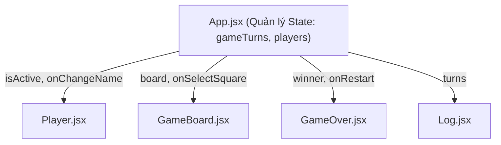

# 📚 Section 04: Tic-Tac-Toe Game - Tổng Hợp Kiến Thức Cốt Lõi & Deep Dive

> Khóa học: **[React - The Complete Guide (incl. Next.js, Redux)](https://www.udemy.com/course/react-the-complete-guide-incl-redux/)** - Giảng viên: Maximilian Schwarzmüller.

Tài liệu này tổng hợp toàn bộ các kiến thức nâng cao về **quản lý State, luồng dữ liệu (Data Flow), tối ưu hóa kiến trúc Component và nguyên tắc Immutability** được thực hành trong dự án thực tế **Tic-Tac-Toe Game**.

---

## 📑 Mục Lục

1. [Cấu Trúc Dự Án (Project Structure)](#1-cấu-trúc-dự-án-project-structure)
2. [Lifting State Up (Nâng State Lên Component Cha)](#2-lifting-state-up-nâng-state-lên-component-cha)
3. [Derived State / Computed Values (Trạng Thái Suy Ra - Tránh State Thừa)](#3-derived-state--computed-values-trạng-thái-suy-ra---tránh-state-thừa)
4. [Quản Lý State Phức Tạp & Nguyên Tắc Immutability (Bất Biến)](#4-quản-lý-state-phức-tạp--nguyên-tắc-immutability-bất-biến)
5. [Cập Nhật State Phụ Thuộc State Cũ (`prevState`)](#5-cập-nhật-state-phụ-thuộc-state-cũ-prevstate)
6. [Two-Way Binding (Ràng Buộc Dữ Liệu Hai Chiều)](#6-two-way-binding-ràng-buộc-dữ-liệu-hai-chiều)
7. [Giao Tiếp Giữa Các Component Qua Callback Props](#7-giao-tiếp-giữa-các-component-qua-callback-props)
8. [Conditional Rendering & List Rendering Nâng Cao](#8-conditional-rendering--list-rendering-nâng-cao)
9. [Defensive Programming & Tối Ưu Trải Nghiệm Người Dùng (UX)](#9-defensive-programming--tối-ưu-trải-nghiệm-người-dùng-ux)
10. [Clean Architecture & Quy Trình Refactoring](#10-clean-architecture--quy-trình-refactoring)
11. [Hướng Dẫn Cài Đặt & Khởi Chạy Dự Án](#11-hướng-dẫn-cài-đặt--khởi-chạy-dự-án)

---

## 1. Cấu Trúc Dự Án (Project Structure)

Dự án được xây dựng bằng **Vite + React**, tổ chức toàn bộ các UI components vào thư mục riêng biệt `src/components/`, phân định rõ ràng giữa UI, logic tính toán và dữ liệu thắng cuộc:

```text
04-tic-tac-toe-game/
├── public/
│   ├── bg-pattern-dark.png      # Ảnh nền họa tiết tối
│   ├── bg-pattern.png           # Ảnh nền họa tiết sáng
│   └── game-logo.png            # Logo trò chơi Tic-Tac-Toe
├── src/
│   ├── assets/                  # Tài nguyên tĩnh (svg icons)
│   ├── components/              # Các UI Components tái sử dụng
│   │   ├── GameBoard.jsx        # Lưới bàn cờ 3x3 và xử lý click chọn ô
│   │   ├── GameOver.jsx         # Màn hình kết thúc thông báo người thắng/hòa & Rematch
│   │   ├── Log.jsx              # Danh sách lịch sử từng lượt đi của trận đấu
│   │   └── Player.jsx           # Hiển thị thông tin người chơi, biểu tượng và sửa tên
│   ├── App.jsx                  # Root Component quản lý state tổng và luồng dữ liệu
│   ├── index.css                # Global Styles, CSS Grid/Flexbox và animations
│   ├── index.jsx                # Entry point render ứng dụng vào root DOM
│   └── winning-combinations.js  # Mảng định nghĩa 8 tổ hợp hàng, cột, chéo để thắng
├── index.html                   # File HTML gốc
├── vite.config.js               # Cấu hình Vite (Port 3000, tự động mở Chrome)
└── package.json                 # Khai báo dependencies và scripts
```

---

## 2. Lifting State Up (Nâng State Lên Component Cha)

### 🔹 Vấn đề đặt ra
Trong trò chơi Tic-Tac-Toe:
- Khi người chơi click vào một ô trong `GameBoard`, lượt chơi thay đổi.
- `Player` cần biết ai đang đến lượt (`activePlayer`) để kích hoạt hiệu ứng viền vàng nổi bật.
- `Log` cần biết thông tin nước đi vừa đánh để ghi nhận lịch sử.
- `GameOver` cần biết kết quả thắng hay hòa để hiển thị màn hình kết thúc.

Nếu lưu trữ state bàn cờ hoặc lượt chơi bên trong `GameBoard`, các component anh em (`Player`, `Log`, `GameOver`) sẽ **hoàn toàn không thể truy cập** được dữ liệu này.

### 🔹 Giải pháp: Nâng State lên `App.jsx`
Ta chuyển quyền quản lý state lên component cha chung gần nhất là `App`. Sau đó, `App` truyền dữ liệu xuống các component con qua **props**, và nhận lại sự kiện thông qua các **hàm callback**.



---

## 3. Derived State / Computed Values (Trạng Thái Suy Ra - Tránh State Thừa)

Một sai lầm rất phổ biến của người mới học React là tạo quá nhiều `useState` độc lập:
- ❌ `const [activePlayer, setActivePlayer] = useState('X')`
- ❌ `const [gameBoard, setGameBoard] = useState(...)`
- ❌ `const [winner, setWinner] = useState(null)`
- ❌ `const [hasDraw, setHasDraw] = useState(false)`

> ⚠️ **Nguy cơ khi lạm dụng nhiều State:**
> - Các state dễ bị lệch pha, xung đột hoặc không đồng bộ khi một sự kiện xảy ra (Stale State).
> - Gây re-render thừa thãi nhiều lần.
> - Code dài dòng, khó kiểm soát và khó bảo trì.

### 🔹 Nguyên tắc cốt lõi: Chỉ quản lý State tối thiểu cần thiết!
Trong ứng dụng này, toàn bộ diễn biến trận đấu có thể được tái hiện đầy đủ chỉ từ **duy nhất một state: `gameTurns`** (danh sách các lượt đi).

Mỗi khi `App` re-render:
1. **Lượt người chơi hiện tại** được tính từ `gameTurns`:
   ```javascript
   const deriveActivePlayer = (gameTurns) => {
     let currentPlayer = "X";
     if (gameTurns.length > 0 && gameTurns[0].player === "X") {
       currentPlayer = "O";
     }
     return currentPlayer;
   };
   ```
2. **Bàn cờ hiện tại** được vẽ lại từ `gameTurns`:
   ```javascript
   const deriveGameBoard = (gameTurns) => {
     let gameBoard = [...INITIAL_GAME_BOARD.map((innerArray) => [...innerArray])];
     for (const turn of gameTurns) {
       const { square, player } = turn;
       gameBoard[square.row][square.col] = player;
     }
     return gameBoard;
   };
   ```
3. **Người chiến thắng** được đối chiếu từ `gameBoard` và danh sách tên `players`:
   ```javascript
   const deriveWinner = (gameBoard, players) => {
     for (const combination of WINNING_COMBINATIONS) {
       const firstSquareSymbol = gameBoard[combination[0].row][combination[0].column];
       const secondSquareSymbol = gameBoard[combination[1].row][combination[1].column];
       const thirdSquareSymbol = gameBoard[combination[2].row][combination[2].column];

       if (
         firstSquareSymbol &&
         firstSquareSymbol === secondSquareSymbol &&
         firstSquareSymbol === thirdSquareSymbol
       ) {
         return players[firstSquareSymbol];
       }
     }
     return null;
   };
   ```
4. **Trạng thái hòa** đơn giản là khi đã đi đủ 9 ô mà chưa có người thắng:
   ```javascript
   const hasDraw = gameTurns.length === 9 && !winner;
   ```

---

## 4. Quản Lý State Phức Tạp & Nguyên Tắc Immutability (Bất Biến)

### 🔹 Tuyệt đối không Mutate (đột biến) Object và Array trực tiếp
Trong JavaScript, Array và Object là kiểu dữ liệu tham chiếu (Reference Type). Nếu bạn chỉnh sửa trực tiếp giá trị bên trong mà không tạo bản sao mới:
- React có thể không nhận diện được sự thay đổi để re-render giao diện.
- Dữ liệu gốc dùng chung ở nhiều nơi có thể bị phá hỏng ngoài ý muốn.

### 🔹 Cảnh giác với Deep Copy mảng 2 chiều
```javascript
// ❌ SAI: Shallow copy mảng ngoài, nhưng các mảng con bên trong vẫn giữ nguyên tham chiếu cũ!
let gameBoard = [...INITIAL_GAME_BOARD]; 
gameBoard[0][0] = 'X'; // INITIAL_GAME_BOARD gốc bị thay đổi theo!

// ✅ ĐÚNG: Deep copy toàn bộ các hàng bên trong bằng .map()
let gameBoard = [...INITIAL_GAME_BOARD.map((innerArray) => [...innerArray])];
```

---

## 5. Cập Nhật State Phụ Thuộc State Cũ (`prevState`)

Vì các hàm cập nhật state của React là **bất đồng bộ (asynchronous)** và có cơ chế gộp (batching), nếu giá trị state mới cần dựa trên giá trị state cũ, **bắt buộc** phải truyền một hàm callback nhận `prevState`.

### 🔹 Cập nhật danh sách lượt đi (`gameTurns`):
```javascript
const handleSelectSquare = (rowIndex, colIndex) => {
  setGameTurns((prevTurns) => {
    // Luôn suy ra activePlayer từ prevTurns mới nhất
    const currentPlayer = deriveActivePlayer(prevTurns);

    const updatedTurns = [
      { square: { row: rowIndex, col: colIndex }, player: currentPlayer },
      ...prevTurns, // Giữ tính bất biến, không dùng prevTurns.unshift()
    ];

    return updatedTurns;
  });
};
```

### 🔹 Cập nhật Object theo Key động (`players`):
Sử dụng Computed Property Name `[symbol]` của ES6 để cập nhật đúng người chơi cần sửa tên:
```javascript
const handlePlayerNameChange = (symbol, newName) => {
  setPlayers((prevPlayers) => ({
    ...prevPlayers,
    [symbol]: newName, // Ghi đè chỉ riêng key 'X' hoặc 'O'
  }));
};
```

---

## 6. Two-Way Binding (Ràng Buộc Dữ Liệu Hai Chiều)

Áp dụng trong [Player.jsx](file:///Users/baoha/Desktop/react-projects/udemy-react-complete-guide/04-tic-tac-toe-game/src/components/Player.jsx) khi người dùng nhập tên mới vào ô `<input>`:

1. **State -> UI**: Thuộc tính `value` của `<input>` được kiểm soát bởi state `playerName`.
2. **UI -> State**: Sự kiện `onChange` lắng nghe từng ký tự người dùng gõ để cập nhật ngược lại vào `playerName`.

```jsx
const [playerName, setPlayerName] = useState(initialName);

const handleChange = (e) => {
  setPlayerName(e.target.value);
};

<input
  type="text"
  required
  value={playerName}     {/* Data đẩy từ State ra UI */}
  onChange={handleChange} {/* Sự kiện từ UI cập nhật ngược lại State */}
/>
```

---

## 7. Giao Tiếp Giữa Các Component Qua Callback Props

Các component con không thể trực tiếp thay đổi state của component cha, mà chỉ gửi tín hiệu thông qua các hàm callback được cha truyền xuống qua props:

| Component Con | Prop Callback | Mục Đích |
| :--- | :--- | :--- |
| `GameBoard` | `onSelectSquare(row, col)` | Báo cho `App` biết ô vừa được click để ghi nhận turn |
| `Player` | `onChangeName(symbol, newName)` | Báo cho `App` biết tên mới sau khi bấm Save |
| `GameOver` | `onRestart` | Báo cho `App` reset mảng `gameTurns = []` |

> 🌟 **Lưu ý quan trọng về Destructuring Props:**
> React luôn truyền **một object duy nhất** chứa toàn bộ props vào component.
> ```javascript
> // ❌ SAI: Nhận tham số riêng lẻ (sẽ hiểu param 1 là toàn bộ props object)
> export default function GameBoard(onSelectSquare, board)
>
> // ✅ ĐÚNG: Destructuring với cặp ngoặc nhọn { }
> export default function GameBoard({ onSelectSquare, board })
> ```

---

## 8. Conditional Rendering & List Rendering Nâng Cao

### 🔹 Render màn hình GameOver khi trận đấu kết thúc
```jsx
{(winner || hasDraw) && (
  <GameOver winner={winner} onRestart={handleRestart} />
)}
```

### 🔹 Render thông báo trong [GameOver.jsx](file:///Users/baoha/Desktop/react-projects/udemy-react-complete-guide/04-tic-tac-toe-game/src/components/GameOver.jsx)
Dùng toán tử ba ngôi (Ternary Operator):
```jsx
{winner ? <p>{winner} won!</p> : <p>It's a draw</p>}
```

### 🔹 Render danh sách lịch sử trong [Log.jsx](file:///Users/baoha/Desktop/react-projects/udemy-react-complete-guide/04-tic-tac-toe-game/src/components/Log.jsx)
Sử dụng template string kết hợp tọa độ làm `key` duy nhất và ổn định:
```jsx
<ol id="log">
  {turns.map((turn) => (
    <li key={`${turn.square.row}-${turn.square.col}`}>
      {turn.player} selected {turn.square.row}, {turn.square.col}
    </li>
  ))}
</ol>
```

---

## 9. Defensive Programming & Tối Ưu Trải Nghiệm Người Dùng (UX)

Trong quá trình hoàn thiện, chúng ta đã bổ sung các xử lý tinh tế giúp ứng dụng hoạt động mượt mà và chống lỗi ngoại lệ:

1. **Lưu nhanh bằng phím `Enter`**:
   Người dùng có thể gõ xong tên và nhấn phím Enter để lưu ngay thay vì phải click chuột:
   ```javascript
   const handleKeyDown = (e) => {
     if (e.key === "Enter") {
       handleEditClick();
     }
   };
   ```

2. **Chống rỗng tên (Trim & Fallback)**:
   Nếu người dùng xóa sạch tên và nhấn Save, tên sẽ tự động fallback về giá trị mặc định ban đầu:
   ```javascript
   const trimmedName = playerName.trim() || initialName;
   ```

3. **Chặn click khi trận đấu đã xong (Defensive Guard)**:
   ```javascript
   const handleSelectSquare = (rowIndex, colIndex) => {
     if (winner || hasDraw) return; // Không xử lý thêm nước đi nếu game đã dừng
     // ...
   };
   ```

4. **Disable ô cờ đã được chọn**:
   ```jsx
   <button onClick={() => onSelectSquare(rowIndex, colIndex)} disabled={playerSymbol !== null}>
     {playerSymbol}
   </button>
   ```

---

## 10. Clean Architecture & Quy Trình Refactoring

Dự án tuân theo các nguyên tắc chuẩn của Clean Code:

1. **Tách biệt mối quan tâm (Separation of Concerns)**:
   - Component `App()` chỉ tập trung vào việc ghép nối giao diện và quản lý state.
   - Các logic tính toán thuần túy (`deriveActivePlayer`, `deriveGameBoard`, `deriveWinner`) được tách thành các pure function độc lập nằm ngoài component, giúp dễ dàng viết unit test mà không cần mount DOM.
2. **Sử dụng Constants thay cho Magic Strings**:
   - `PLAYERS`: Quản lý tên mặc định tập trung.
   - `INITIAL_GAME_BOARD`: Quản lý trạng thái khởi tạo của bàn cờ.
3. **Tối ưu hóa hiệu năng vòng lặp**:
   - Thêm `return` trực tiếp ngay khi tìm thấy người chiến thắng trong `deriveWinner` để dừng vòng lặp sớm.

---

## 11. Hướng Dẫn Cài Đặt & Khởi Chạy Dự Án

### 1. Cài đặt các thư viện phụ thuộc:
```bash
npm install
```

### 2. Khởi chạy môi trường phát triển (Dev Server):
```bash
npm run dev
```
- Server chạy mặc định tại: `http://localhost:3000`
- Tự động mở trình duyệt theo cấu hình trong `vite.config.js`.

### 3. Build mã nguồn production:
```bash
npm run build
```

---

Chúc bạn tiếp tục làm chủ các kiến thức chuyên sâu tiếp theo của React! 🚀
