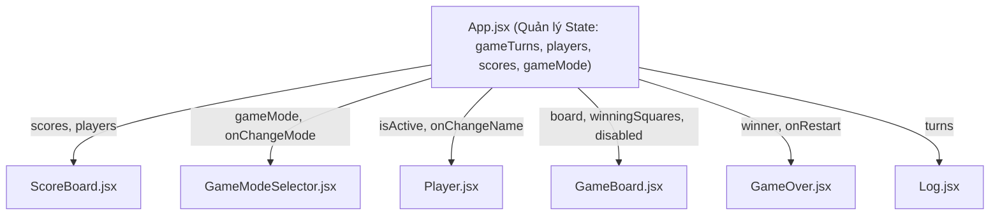

# 📚 Section 04: Tic-Tac-Toe Game - Tổng Hợp Kiến Thức Cốt Lõi & Deep Dive

> Khóa học: **[React - The Complete Guide (incl. Next.js, Redux)](https://www.udemy.com/course/react-the-complete-guide-incl-redux/)** - Giảng viên: Maximilian Schwarzmüller.

Tài liệu này tổng hợp toàn bộ các kiến thức từ cơ bản đến nâng cao về **quản lý State, luồng dữ liệu (Data Flow), tối ưu hóa kiến trúc Component, nguyên tắc Immutability, tích hợp thuật toán AI (Minimax), Web Audio API và thư viện bên thứ 3 (Canvas Confetti)** được thực hành trong dự án thực tế **Tic-Tac-Toe Game**.

---

## 📑 Mục Lục

1. [Cấu Trúc Dự Án (Project Structure)](#1-cấu-trúc-dự-án-project-structure)
2. [Lifting State Up (Nâng State Lên Component Cha)](#2-lifting-state-up-nâng-state-lên-component-cha)
3. [Derived State / Computed Values (Trạng Thái Suy Ra - Tránh State Thừa)](#3-derived-state--computed-values-trạng-thái-suy-ra---tránh-state-thừa)
4. [Quản Lý State Phức Tạp & Nguyên Tắc Immutability (Bất Biến)](#4-quản-lý-state-phức-tạp--nguyên-tắc-immutability-bất-biến)
5. [Cập Nhật State Phụ Thuộc State Cũ (`prevState`)](#5-cập-nhật-state-phụ-thuộc-state-cũ-prevstate)
6. [Two-Way Binding (Ràng Buộc Dữ Liệu Hai Chiều)](#6-two-way-binding-ràng-buộc-dữ-liệu-hai-chiều)
7. [Giao Tiếp Giữa Các Component Qua Callback Props](#7-giao-tiếp-giữa-các-component-qua-callback-props)
8. [Bảng Điểm (ScoreBoard) & Lưu Trữ `localStorage`](#8-bảng-điểm-scoreboard--lưu-trữ-localstorage)
9. [Tính Năng Undo Nước Đi & Time Travel](#9-tính-năng-undo-nước-đi--time-travel)
10. [Chế Độ Chơi Với Máy (PvE) & Thuật Toán AI Minimax](#10-chế-độ-chơi-với-máy-pve--thuật-toán-ai-minimax)
11. [Hiệu Ứng Âm Thanh Với Web Audio API](#11-hiệu-ứng-âm-thanh-với-web-audio-api)
12. [Hiệu Ứng Pháo Hoa Confetti & Highlight 3 Ô Chiến Thắng](#12-hiệu-ứng-pháo-hoa-confetti--highlight-3-ô-chiến-thắng)
13. [Trải Nghiệm GameOver, Z-Index & Defensive Programming](#13-trải-nghiệm-gameover-z-index--defensive-programming)
14. [Hướng Dẫn Cài Đặt & Khởi Chạy Dự Án](#14-hướng-dẫn-cài-đặt--khởi-chạy-dự-án)

---

## 1. Cấu Trúc Dự Án (Project Structure)

Dự án được xây dựng bằng **Vite + React**, tổ chức toàn bộ các UI components vào thư mục `src/components/`, phân tách rõ ràng giữa UI, thuật toán AI, module âm thanh và dữ liệu thắng cuộc:

```text
04-tic-tac-toe-game/
├── public/
│   ├── bg-pattern-dark.png          # Ảnh nền họa tiết tối
│   ├── bg-pattern.png               # Ảnh nền họa tiết sáng
│   └── game-logo.png                # Logo trò chơi Tic-Tac-Toe
├── src/
│   ├── assets/                      # Tài nguyên tĩnh (svg icons)
│   ├── components/                  # Các UI Components tái sử dụng
│   │   ├── GameBoard.jsx            # Lưới bàn cờ 3x3 và highlight ô thắng
│   │   ├── GameModeSelector.jsx     # Bộ chọn chế độ (2 Players, Bot Easy, Bot Hard)
│   │   ├── GameOver.jsx             # Màn hình kết thúc ván (thắng/hòa) & Rematch
│   │   ├── Log.jsx                  # Danh sách lịch sử từng lượt đi của trận đấu
│   │   ├── Player.jsx               # Hiển thị thông tin người chơi, biểu tượng và sửa tên
│   │   └── ScoreBoard.jsx           # Bảng đếm tỉ số X - Draws - O & nút Reset Scores
│   ├── ai.js                        # Thuật toán AI: Random Move & Minimax bất bại
│   ├── sound.js                     # Module âm thanh thuần Web Audio API (Move, Win, Draw, Undo)
│   ├── winning-combinations.js      # Mảng định nghĩa 8 tổ hợp hàng, cột, chéo để thắng
│   ├── App.jsx                      # Root Component điều phối state tổng và logic game
│   ├── index.css                    # Global Styles, CSS Grid/Flexbox và animations
│   └── index.jsx                    # Entry point render ứng dụng vào root DOM
├── index.html                       # File HTML gốc
├── vite.config.js                   # Cấu hình Vite (Port 3000, tự động mở Chrome)
└── package.json                     # Khai báo dependencies (kèm canvas-confetti)
```

---

## 2. Lifting State Up (Nâng State Lên Component Cha)

### 🔹 Vấn đề đặt ra
Trong trò chơi Tic-Tac-Toe:
- Khi người chơi click vào một ô trong `GameBoard`, lượt chơi thay đổi.
- `Player` cần biết ai đang đến lượt (`activePlayer`) để kích hoạt hiệu ứng viền vàng nhấp nháy.
- `ScoreBoard` cần cập nhật điểm số khi một ván đấu kết thúc.
- `Log` cần biết thông tin nước đi vừa đánh để hiển thị lịch sử.
- `GameOver` cần biết kết quả thắng hay hòa để hiển thị màn hình chúc mừng.

Nếu lưu trữ state bàn cờ hoặc lượt chơi bên trong `GameBoard`, các component anh em (`Player`, `ScoreBoard`, `Log`, `GameOver`) sẽ **hoàn toàn không thể truy cập** được dữ liệu này.

### 🔹 Giải pháp: Nâng State lên `App.jsx`
Ta chuyển quyền quản lý state lên component cha chung gần nhất là `App`. Sau đó, `App` truyền dữ liệu xuống các component con qua **props**, và nhận lại sự kiện thông qua các **hàm callback**.



---

## 3. Derived State / Computed Values (Trạng Thái Suy Ra - Tránh State Thừa)

Một sai lầm rất phổ biến của người mới học React là tạo quá nhiều `useState` độc lập:
- ❌ `const [activePlayer, setActivePlayer] = useState('X')`
- ❌ `const [gameBoard, setGameBoard] = useState(...)`
- ❌ `const [winner, setWinner] = useState(null)`
- ❌ `const [hasDraw, setHasDraw] = useState(false)`

> ⚠️ **Nguy cơ khi lạm dụng nhiều State:**
> - Các state dễ bị lệch pha, xung đột hoặc không đồng bộ khi một sự kiện xảy ra (Stale State).
> - Gây re-render thừa thãi nhiều lần.
> - Code dài dòng, khó kiểm soát và khó bảo trì.

### 🔹 Nguyên tắc cốt lõi: Chỉ quản lý State tối thiểu cần thiết!
Trong ứng dụng này, toàn bộ diễn biến trận đấu được tái hiện đầy đủ chỉ từ **duy nhất một state: `gameTurns`** (danh sách các lượt đi).

Mỗi khi `App` re-render:
1. **Lượt người chơi hiện tại** được tính từ `gameTurns`:
   ```javascript
   const deriveActivePlayer = (gameTurns) => {
     let currentPlayer = "X";
     if (gameTurns.length > 0 && gameTurns[0].player === "X") {
       currentPlayer = "O";
     }
     return currentPlayer;
   };
   ```
2. **Bàn cờ hiện tại** được vẽ lại từ `gameTurns`:
   ```javascript
   const deriveGameBoard = (gameTurns) => {
     let gameBoard = [...INITIAL_GAME_BOARD.map((innerArray) => [...innerArray])];
     for (const turn of gameTurns) {
       const { square, player } = turn;
       gameBoard[square.row][square.col] = player;
     }
     return gameBoard;
   };
   ```
3. **Người chiến thắng & Tọa độ ô thắng cuộc**:
   ```javascript
   const deriveWinner = (gameBoard, players) => {
     for (const combination of WINNING_COMBINATIONS) {
       const firstSquareSymbol = gameBoard[combination[0].row][combination[0].column];
       const secondSquareSymbol = gameBoard[combination[1].row][combination[1].column];
       const thirdSquareSymbol = gameBoard[combination[2].row][combination[2].column];

       if (
         firstSquareSymbol &&
         firstSquareSymbol === secondSquareSymbol &&
         firstSquareSymbol === thirdSquareSymbol
       ) {
         return {
           winner: players[firstSquareSymbol],
           winningSquares: combination,
         };
       }
     }
     return { winner: null, winningSquares: [] };
   };
   ```
4. **Trạng thái hòa** đơn giản là khi đã đi đủ 9 ô mà chưa có người thắng:
   ```javascript
   const hasDraw = gameTurns.length === 9 && !winner;
   ```

---

## 4. Quản Lý State Phức Tạp & Nguyên Tắc Immutability (Bất Biến)

### 🔹 Tuyệt đối không Mutate (đột biến) Object và Array trực tiếp
Trong JavaScript, Array và Object là kiểu dữ liệu tham chiếu (Reference Type). Nếu chỉnh sửa trực tiếp giá trị bên trong mà không tạo bản sao mới:
- React có thể không nhận diện được sự thay đổi để re-render giao diện.
- Dữ liệu gốc dùng chung ở nhiều nơi có thể bị phá hỏng ngoài ý muốn.

### 🔹 Cảnh giác với Deep Copy mảng 2 chiều
```javascript
// ❌ SAI: Shallow copy mảng ngoài, nhưng các mảng con bên trong vẫn giữ nguyên tham chiếu cũ!
let gameBoard = [...INITIAL_GAME_BOARD]; 
gameBoard[0][0] = 'X'; // INITIAL_GAME_BOARD gốc bị thay đổi theo!

// ✅ ĐÚNG: Deep copy toàn bộ các hàng bên trong bằng .map()
let gameBoard = [...INITIAL_GAME_BOARD.map((innerArray) => [...innerArray])];
```

---

## 5. Cập Nhật State Phụ Thuộc State Cũ (`prevState`)

Vì các hàm cập nhật state của React là **bất đồng bộ (asynchronous)** và có cơ chế gộp (batching), nếu giá trị state mới cần dựa trên giá trị state cũ, **bắt buộc** phải truyền một hàm callback nhận `prevState`.

### 🔹 Cập nhật danh sách lượt đi (`gameTurns`):
```javascript
const updatedTurns = [
  { square: { row: rowIndex, col: colIndex }, player: currentPlayer },
  ...gameTurns, // Đặt lượt mới nhất lên đầu mảng (Index 0)
];
setGameTurns(updatedTurns);
```

### 🔹 Cập nhật Object theo Key động (`players`):
Sử dụng Computed Property Name `[symbol]` của ES6 để cập nhật đúng người chơi cần sửa tên:
```javascript
const handlePlayerNameChange = (symbol, newName) => {
  setPlayers((prevPlayers) => ({
    ...prevPlayers,
    [symbol]: newName, // Ghi đè chỉ riêng key 'X' hoặc 'O'
  }));
};
```

---

## 6. Two-Way Binding (Ràng Buộc Dữ Liệu Hai Chiều)

Áp dụng trong [Player.jsx](file:///Users/baoha/Desktop/react-projects/udemy-react-complete-guide/04-tic-tac-toe-game/src/components/Player.jsx) khi người dùng nhập tên mới vào ô `<input>`:

1. **State -> UI**: Thuộc tính `value` của `<input>` được kiểm soát bởi state `playerName`.
2. **UI -> State**: Sự kiện `onChange` lắng nghe từng ký tự người dùng gõ để cập nhật ngược lại vào `playerName`.

```jsx
const [playerName, setPlayerName] = useState(initialName);

const handleChange = (e) => {
  setPlayerName(e.target.value);
};

<input
  type="text"
  required
  value={playerName}      {/* Data đẩy từ State ra UI */}
  onChange={handleChange} {/* Sự kiện từ UI cập nhật ngược lại State */}
  onKeyDown={(e) => e.key === "Enter" && handleEditClick()} {/* Bấm Enter để lưu */}
/>
```

---

## 7. Giao Tiếp Giữa Các Component Qua Callback Props

Các component con không trực tiếp thay đổi state của component cha, mà chỉ gửi tín hiệu thông qua các hàm callback được cha truyền xuống qua props:

| Component Con | Prop Callback | Mục Đích |
| :--- | :--- | :--- |
| `GameBoard` | `onSelectSquare(row, col)` | Báo cho `App` biết ô vừa được click để ghi nhận turn |
| `Player` | `onChangeName(symbol, newName)` | Báo cho `App` biết tên mới sau khi bấm Save |
| `GameOver` | `onRestart` | Báo cho `App` reset bàn cờ `gameTurns = []` |
| `ScoreBoard` | `onResetScores` | Báo cho `App` đặt lại toàn bộ điểm số về 0 |
| `GameModeSelector` | `onChangeMode(newMode)` | Báo cho `App` chuyển chế độ và bắt đầu ván mới |

> 🌟 **Lưu ý quan trọng về Destructuring Props:**
> React luôn truyền **một object duy nhất** chứa toàn bộ props vào component:
> ```javascript
> // ❌ SAI: Nhận tham số riêng lẻ (sẽ hiểu param 1 là toàn bộ props object)
> export default function GameBoard(onSelectSquare, board)
>
> // ✅ ĐÚNG: Destructuring với cặp ngoặc nhọn { }
> export default function GameBoard({ onSelectSquare, board, winningSquares, disabled })
> ```

---

## 8. Bảng Điểm (ScoreBoard) & Lưu Trữ `localStorage`

### 🔹 Lazy Initial State (Khởi tạo State lười)
Thay vì đọc `localStorage` mỗi lần component re-render, truyền một hàm callback vào `useState()` để React chỉ thực thi hàm đọc `localStorage` đúng **1 lần duy nhất khi component khởi tạo (Initial Mount)**:

```javascript
const [scores, setScores] = useState(() => {
  try {
    const saved = localStorage.getItem("tic-tac-toe-scores");
    return saved ? JSON.parse(saved) : { X: 0, O: 0, draws: 0 };
  } catch {
    return { X: 0, O: 0, draws: 0 };
  }
});
```

### 🔹 Tự động đồng bộ bằng `useEffect`
```javascript
useEffect(() => {
  localStorage.setItem("tic-tac-toe-scores", JSON.stringify(scores));
}, [scores]);

useEffect(() => {
  localStorage.setItem("tic-tac-toe-players", JSON.stringify(players));
}, [players]);

useEffect(() => {
  localStorage.setItem("tic-tac-toe-mode", gameMode);
}, [gameMode]);
```

---

## 9. Tính Năng Undo Nước Đi & Time Travel

Nhờ kiến trúc lưu trữ toàn bộ các bước đi trong mảng `gameTurns` với nước mới nhất luôn nằm ở `index 0`, việc hoàn tác (Undo) trở nên vô cùng đơn giản:

```javascript
const handleUndo = () => {
  if (gameTurns.length === 0 || winner || hasDraw || isBotThinking) return;

  playUndoSound(!soundEnabledRef.current);

  if (gameMode !== "pvp") {
    // Trong chế độ PvE: lùi đồng thời 2 nước (nước của Bot + nước của Người)
    if (gameTurns.length >= 2) {
      setGameTurns((prevTurns) => prevTurns.slice(2));
    } else {
      setGameTurns((prevTurns) => prevTurns.slice(1));
    }
  } else {
    setGameTurns((prevTurns) => prevTurns.slice(1));
  }
};
```

---

## 10. Chế Độ Chơi Với Máy (PvE) & Thuật Toán AI Minimax

File [ai.js](file:///Users/baoha/Desktop/react-projects/udemy-react-complete-guide/04-tic-tac-toe-game/src/ai.js) cung cấp 2 cấp độ máy:

1. **Bot: Easy (Ngẫu nhiên)**: Tìm các ô trống còn lại và dùng `Math.random()` chọn ngẫu nhiên 1 ô.
2. **Bot: Hard (Minimax Bất Bại)**:
   - Thuật toán tìm kiếm đệ quy cổ điển trong lý thuyết trò chơi hai người (Game Theory).
   - Máy giả lập tất cả các kịch bản có thể xảy ra trong tương lai:
     - Nếu Máy thắng: Điểm số `+10 - depth` (ưu tiên thắng càng nhanh càng tốt).
     - Nếu Người thắng: Điểm số `depth - 10` (trì hoãn thất bại lâu nhất có thể).
     - Nếu Hòa: Điểm số `0`.
   - Máy chọn nước đi tối đa hóa điểm số (`isMaximizing = true`), đồng thời giả định người chơi cũng sẽ luôn đi nước tối ưu nhất để giảm điểm của máy (`isMaximizing = false`).

```javascript
function minimax(board, depth, isMaximizing, aiPlayer, humanPlayer) {
  const winner = checkWinner(board);
  if (winner === aiPlayer) return 10 - depth;
  if (winner === humanPlayer) return depth - 10;

  const available = getAvailableMoves(board);
  if (available.length === 0) return 0;

  if (isMaximizing) {
    let bestScore = -Infinity;
    for (const move of available) {
      board[move.row][move.col] = aiPlayer;
      const score = minimax(board, depth + 1, false, aiPlayer, humanPlayer);
      board[move.row][move.col] = null;
      bestScore = Math.max(bestScore, score);
    }
    return bestScore;
  } else {
    let bestScore = Infinity;
    for (const move of available) {
      board[move.row][move.col] = humanPlayer;
      const score = minimax(board, depth + 1, true, aiPlayer, humanPlayer);
      board[move.row][move.col] = null;
      bestScore = Math.min(bestScore, score);
    }
    return bestScore;
  }
}
```

### 🔹 Hiệu ứng Bot suy nghĩ (Delay 500ms)
Sử dụng `setTimeout` trong `useEffect` khi đến lượt Bot (`activePlayer === 'O'`), tạm khóa bàn cờ qua prop `disabled` để tạo trải nghiệm tự nhiên và ngăn người chơi click đè.

---

## 11. Hiệu Ứng Âm Thanh Với Web Audio API

File [sound.js](file:///Users/baoha/Desktop/react-projects/udemy-react-complete-guide/04-tic-tac-toe-game/src/sound.js) sử dụng `AudioContext` của trình duyệt để tổng hợp sóng âm (Oscillator) trực tiếp trong bộ nhớ:
- **Move**: Sóng Sine quét tần số từ 600Hz xuống 220Hz trong 0.08s (tiếng pop giòn tan).
- **Win Fanfare**: Hợp âm 4 nốt rực rỡ C5 (523Hz) → E5 (659Hz) → G5 (784Hz) → C6 (1046Hz).
- **Draw**: Hợp âm 2 nốt A4 (440Hz) → G4 (392Hz) nhẹ nhàng.
- **Undo**: Sóng quét ngược tần số từ 200Hz lên 500Hz trong 0.09s (tiếng whoosh).

> 💡 **Ưu điểm vượt trội:**
> - Hoàn toàn không cần tải bất kỳ file MP3/WAV nào qua mạng.
> - Phát tức thì (Zero Latency), không bị giật lag trên mọi thiết bị.

---

## 12. Hiệu Ứng Pháo Hoa Confetti & Highlight 3 Ô Chiến Thắng

### 🔹 Bắn Pháo Hoa với `canvas-confetti`
- Khi thắng: Bắn liên tục pháo hoa vàng/bạc từ 2 góc dưới màn hình vào tâm:
  ```javascript
  confetti({
    particleCount: 4,
    angle: 60,
    spread: 55,
    origin: { x: 0, y: 0.7 },
    colors: ["#fcd256", "#f8ca31", "#e1dec7", "#ffffff"],
  });
  ```
- Khi hòa: Bắn chùm pháo hoa lan tỏa từ giữa màn hình.

### 🔹 Highlight 3 Ô Chiến Thắng
Kiểm tra từng ô cờ `(rowIndex, colIndex)` có thuộc mảng `winningSquares` hay không:
```jsx
const isWinningSquare = winningSquares.some(
  (square) => square.row === rowIndex && square.column === colIndex
);

<button className={isWinningSquare ? "highlight" : undefined}>
  {playerSymbol}
</button>
```

---

## 13. Trải Nghiệm GameOver, Z-Index & Defensive Programming

1. **Trễ hiển thị GameOver 1 giây**:
   Khi có người thắng hoặc hòa, 3 ô thắng sẽ lập tức phát sáng vàng rực rỡ để người chơi nhìn rõ bàn cờ. Sau 1 giây (`setTimeout`), modal GameOver mới xuất hiện.
2. **Giải quyết triệt để vấn đề click nút Rematch**:
   - Đặt `<GameOver>` nằm sau `<GameBoard>` trong cây DOM.
   - Thêm `z-index: 10` cho `#game-over` để modal luôn nằm ở lớp trên cùng của stacking context, không bị bàn cờ phía dưới chặn click.
3. **Defensive Guard**:
   Chặn toàn bộ thao tác click nếu trận đấu đã phân định kết quả hoặc khi Bot đang tính toán:
   ```javascript
   if (winner || hasDraw || isBotThinking) return;
   ```

---

## 14. Hướng Dẫn Cài Đặt & Khởi Chạy Dự Án

### 1. Cài đặt các thư viện phụ thuộc:
```bash
npm install
```

### 2. Khởi chạy môi trường phát triển (Dev Server):
```bash
npm run dev
```
- Server chạy mặc định tại: `http://localhost:3000`
- Tự động mở trình duyệt theo cấu hình trong `vite.config.js`.

### 3. Build mã nguồn production:
```bash
npm run build
```

---

Chúc bạn tiếp tục làm chủ các kiến thức chuyên sâu tiếp theo của React! 🚀
